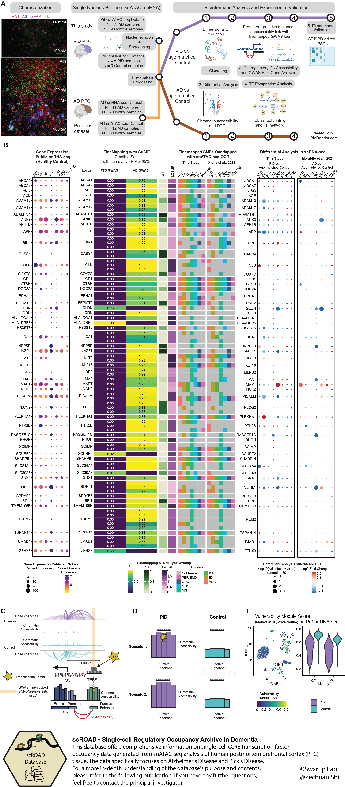

# scMultiomics_identifies_shared_and_distinct_pathways_in_Picks_and_Alzheimers_disease

Introduction
------------

**Human PFC snATAC-seq and snRNA-seq** data

Disease Group: Alzheimer's disease vs Control; Pick’s disease vs Control

The study of transcriptomic and epigenomic variations in neurodegenerative diseases, particularly tauopathies like Pick’s disease (PiD) and Alzheimer’s disease (AD), offers insights into their underlying regulatory mechanisms. Here, we identified critical regulatory changes driving disease progression, revealing potential therapeutic targets. Our comparative analyses uncovered disease-enriched non-coding regions and genome-wide transcription factor (TF) binding differences, linking them to target genes. Notably, we identified a distal human-gained enhancer (HGE) associated with E3 ubiquitin ligase (UBE3A), highlighting disease-specific regulatory alterations. Additionally, fine-mapping of AD risk genes uncovered loci enriched in microglial enhancers and accessible in other cell-types. Shared and distinct TF binding patterns were observed in neurons and glial cells across PiD and AD. We validated our findings using CRISPR to excise a predicted enhancer region in UBE3A and developed an interactive database, scROAD, to visualize predicted single-cell TF occupancy and regulatory networks.

<!--  -->

How to cite
------------
Shi, Z., Das, S., Morabito, S., Miyoshi, E., Stocksdale, J., Emerson, N., Srinivasan, S. S., Shahin, A., Rahimzadeh, N., Cao, Z., Silva, J., Castaneda, A. A., Head, E., Thompson, L., & Swarup, V. (2024). Single-nucleus multi-omics identifies shared and distinct pathways in Pick's and Alzheimer's disease. bioRxiv : the preprint server for biology, 2024.09.06.611761. https://doi.org/10.1101/2024.09.06.611761

Data generated in this study
------------
**scROAD - Single-cell Regulatory Occupancy Archive in Dementia**

Website: http://swaruplab.bio.uci.edu/scROAD

All raw and processed single-nucleus ATAC, single-nucleus RNA and bulk RNA sequencing data have been deposited into the National Center for Biotechnology Information Gene Expression Omnibus (GEO) database and will be made publicly available upon publication. All data in this manuscript have been deposited in the NIH GEO database (GSE259298).

GEO database (GSE259298):

https://www.ncbi.nlm.nih.gov/geo/query/acc.cgi?acc=GSE259298

Contributors
------------

Zechuan Shi [@rootze](rootze.github.io) from Swarup lab at UCI

Sudeshna Das from Swarup lab at UCI

Samuel Morabito [@smorabit](https://smorabit.github.io/) from Swarup lab at UCI

Emily Miyoshi from Swarup lab at UCI

Software, Algorithms, and Resources
------------

Zechuan Shi [@rootze](https://github.com/rootze) created analysis documents that combine code

**Programming software**:
- R v4.1.1 and above
- Python v3.6 and above

**Tools_Software**:
- Cellranger-atac (v2.0.0)
- Split-pipe (v1.0.3)
- ArchR (v1.0.2)
- Signac (v1.9.0)
- ArchRtoSignac (v1.0.4)
- Seurat (v4.3.0)
- PLINK (v1.9 & v2)
- TOBIAS (v0.14.0)
- CellBender (v0.2.1)
- Scrublet (v0.2.3)

Analysis Code
------------
### snATAC-seq analysis

**snATAC-seq processing**
* [Raw Processing](https://github.com/swaruplabUCI/scMultiomics_identifies_shared_and_distinct_pathways_in_PiDandAD/blob/main/Processing_ArchR.Rmd)
* [Integrated analysis for PiD snATAC-seq data with AD](https://github.com/swaruplabUCI/scMultiomics_identifies_shared_and_distinct_pathways_in_PiDandAD/blob/main/integrated_dataset_basics.Rmd)

**Cis-regulatory Analysis and TF-regulatory network**
* [Cicero](https://github.com/swaruplabUCI/scMultiomics_identifies_shared_and_distinct_pathways_in_PiDandAD/tree/main/Cis_regulatory_network)
* [TOBIAS footprinting](https://github.com/swaruplabUCI/scMultiomics_identifies_shared_and_distinct_pathways_in_PiDandAD/tree/main/footprinting)
* [TF network](https://github.com/swaruplabUCI/scMultiomics_identifies_shared_and_distinct_pathways_in_PiDandAD/tree/main/TF_Net)

### snRNA-seq analysis

**snRNA-seq processing**
* [Raw processing](https://github.com/swaruplabUCI/scMultiomics_identifies_shared_and_distinct_pathways_in_PiDandAD/blob/main/snRNA/snRNA_clustering.ipynb)
* [Scanpy to Seurat](https://github.com/swaruplabUCI/scMultiomics_identifies_shared_and_distinct_pathways_in_PiDandAD/blob/main/snRNA/scanpy_to_seurat.Rmd)
* [Differential Gene Expression](https://github.com/swaruplabUCI/scMultiomics_identifies_shared_and_distinct_pathways_in_PiDandAD/blob/main/snRNA/DEG_analysis.Rmd)

### GWAS analysis
**GWAS summary statistics processing**
* [GWAS summary statistics cleaning](https://github.com/swaruplabUCI/scMultiomics_identifies_shared_and_distinct_pathways_in_PiDandAD/blob/main/GWAS/GWAS_Summary_Stat/GWAS_MungeSumstats.R)
* [Fine-mapping with SuSIE](https://github.com/swaruplabUCI/scMultiomics_identifies_shared_and_distinct_pathways_in_PiDandAD/tree/main/GWAS/GWAS_FineMapping/SuSiE)
* [Overlapping with snATAC-seq peakset](https://github.com/swaruplabUCI/scMultiomics_identifies_shared_and_distinct_pathways_in_PiDandAD/tree/main/GWAS/GWAS_FineMapping/Overlapped_w_snATAC)

Getting help
------------
In case of any issues/questions/comments, please check out the [Issues](https://github.com/rootze/scMultiomics_identifies_shared_and_distinct_pathways_in_PiDandAD/issues). Otherwise, please write an issue for any questions [here](https://github.com/rootze/scMultiomics_identifies_shared_and_distinct_pathways_in_PiDandAD/issues).
